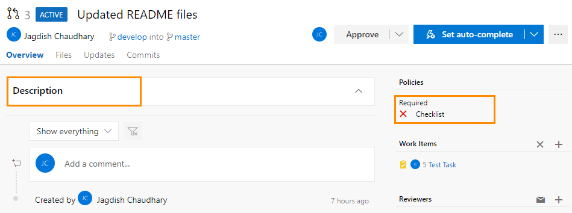

# Checklist Checker :white_check_mark:
> *Custom Policy in Azure DevOps to check if checklist is present in description of Pull Request.*</br>

### Table of Contents
* [About](#about)
* [Prerequisites](#prerequisites)
* [Installation](#installation)
* [Usage](#usage)
* [References](#References)
### About
When a Pull Request is created/updated, this tool checks the description of Pull Request for specific keywords ("Checklist", "Yes", "No") and sets the Pull Request status (succeeded/failed) in Azure DevOps.</br>
 </br>
 </br>
WebApp is hosted [here](https://checklist-checker.herokuapp.com/).</br>
### Prerequisites
 * [NodeJs](https://nodejs.org/en/)
### Installation
Clone the repository
```console
$ git clone https://github.com/jagdish7908/Check.git && cd Check
```
Install dependencies
```console
$ npm install
```
### Usage
```console
$ node app.js
```
### References
 * [MS Docs](https://docs.microsoft.com/en-us/azure/devops/repos/git/create-pr-status-server?view=azure-devops)
