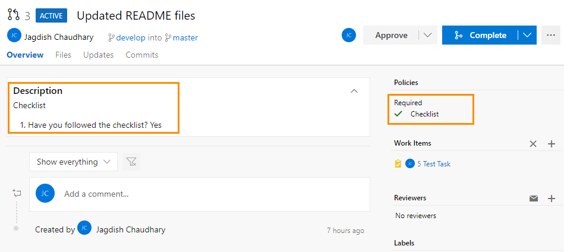

# Checklist Checker :white_check_mark:
> *Custom Policy in Azure DevOps to check if checklist is present in description of Pull Request.*</br>

### Table of Contents
* [About](#about)
* [Prerequisites](#prerequisites)
* [Installation](#installation)
* [Usage](#usage)
* [Integration with Azure DevOps](#integration-with-azure-devops)
* [References](#references)
### About
When a Pull Request is created/updated, this tool checks the description of Pull Request for specific keywords ("Checklist", "Yes", "No") and sets the Pull Request status (succeeded/failed) in Azure DevOps.</br>
 </br>
### Prerequisites
 * [NodeJs](https://nodejs.org/en/)
### Installation
Clone the repository
```console
$ git clone https://github.com/jagdish7908/Check.git && cd Check
```
Install dependencies
```console
$ npm install
```
Create an environment variable for your collection URL, replacing <your account> with the name of your Azure DevOps organization.
```console
$ setx COLLECTIONURL "https://dev.azure.com/<your account>"
```
Create a personal auth token (PAT) for your app to use, following these instructions: [Authenticating with personal access tokens.](https://docs.microsoft.com/en-us/azure/devops/organizations/accounts/use-personal-access-tokens-to-authenticate?view=azure-devops) You should create a new PAT for every service that you use to access your account, naming it appropriately.
```console
$ setx TOKEN "yourtokengoeshere"
```
### Usage
```console
$ node app.js
```
### Integration with Azure DevOps
[Configure web hook for Pull Requests in Azure DevOps](https://docs.microsoft.com/en-us/azure/devops/repos/git/create-pr-status-server?view=azure-devops#configure-a-service-hook-for-pr-events)
### References
 * [Create a pull request status server with Node.js](https://docs.microsoft.com/en-us/azure/devops/repos/git/create-pr-status-server?view=azure-devops)
